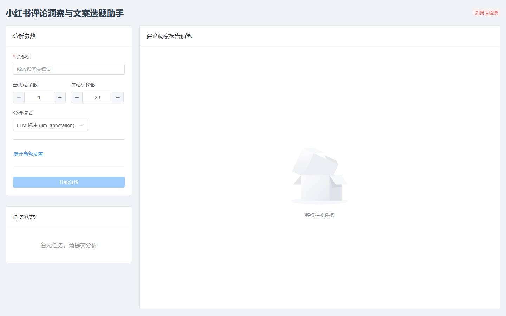
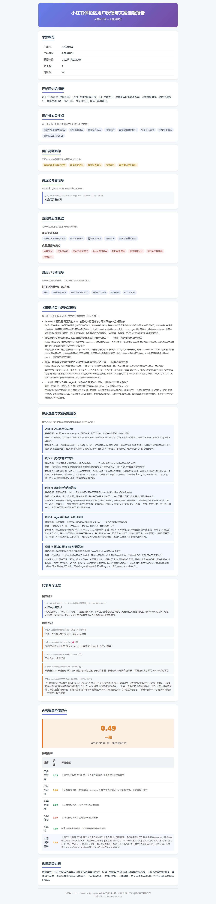

# XHS Comment Insight Agent

小红书评论洞察与文案选题助手

基于小红书公开可见帖子与评论，自动生成用户反馈洞察与内容选题报告的智能分析系统。

## 项目展示


*前端分析界面：输入关键词、设置采集参数、提交分析任务*


*生成的 HTML 报告：采集概览、用户关注点、高频疑问、代表评论证据等内容*

## 功能

- 🔍 **小红书采集** — 基于 Playwright 的浏览器自动化，搜索并采集指定关键词下的帖子与评论
- 🧠 **LLM 语义标注** — 对每条评论进行情感分析、需求/痛点/投诉/解决方案标签提取
- 📊 **内容选题评分** — 6 维规则评分（用户关注强度、负面反馈强度、方案提及度、购买信号、时效性、综合评分）
- 📄 **HTML 报告生成** — 12 章结构化报告，包含采集概览、用户关注点、高频疑问、选题建议、代表评论证据等
- ✅ **质量评审** — 规则 + 可选 LLM 评审，不通过时自动修订
- 👤 **人工审核门控** — LangGraph interrupt 实现 Human-in-the-Loop，支持审核后报告修订
- 🔗 **评论主题聚类** — Embedding + Cosine Similarity 聚类，发现高频讨论主题
- 🤖 **飞书机器人** — 长连接接收私聊指令，自动分析并推送报告链接
- 🖥️ **Vue 3 前端** — 关键词输入、任务状态轮询、报告预览、人工审核操作

## 快速开始

### 环境要求

- Python 3.12+
- Node.js 18+
- Playwright 浏览器（首次运行自动下载 Chromium）

### 安装

```bash
# 克隆项目
git clone https://github.com/Lanwnzi/xhs-.git
cd xhs-

# Python 依赖
pip install -r requirements.txt

# Playwright 浏览器
playwright install chromium

# 前端依赖
cd frontend
npm install
cd ..
```

### 配置

复制环境变量模板并填入真实值：

```bash
cp .env.example .env
```

`.env` 必须配置项：

| 变量 | 说明 |
|---|---|
| `LLM_BASE_URL` | OpenAI 兼容的 LLM API 地址 |
| `LLM_API_KEY` | LLM API 密钥 |
| `LLM_MODEL` | 模型名称 |

可选配置：

| 变量 | 说明 | 默认值 |
|---|---|---|
| `REPORT_REVIEW_LLM_ENABLED` | 启用 LLM 质量评审 | `false` |
| `FEISHU_BOT_ENABLED` | 启用飞书机器人 | `false` |
| `COMMENT_CLUSTERING_ENABLED` | 启用评论聚类 | `true` |
| `COMMENT_CLUSTER_SIM_THRESHOLD` | 聚类相似度阈值 | `0.72` |

### 运行

```bash
# 启动后端
python -m uvicorn src.api.main:app --reload --host 0.0.0.0 --port 8000

# 启动前端（另一个终端）
cd frontend
npm run dev

# 启动飞书机器人（可选）
python scripts/run_feishu_bot.py
```

打开 http://localhost:5173 提交分析任务。

## 架构

### Agent 流水线

```
collect → normalize → annotate(LLM) → aggregate → score → report
                                                          │
                                               ┌─ agent_review ─┐
                                               │  human_review  │
                                               └──── merge ─────┘
                                                          │
                                                  clustering(旁路)
                                                          │
                                                  re-render report
                                                          │
                                                  quality_review
```

### 项目结构

```
src/
├── adapters/          # 采集适配器（XhsPlaywrightAdapter、XhsImportAdapter）
├── agents/            # 各 Agent 实现
│   ├── source_agent.py              # 采集
│   ├── normalize_agent.py           # 标准化
│   ├── llm_comment_analyzer_agent.py # LLM 语义标注
│   ├── annotation_aggregator.py     # 标注聚合
│   ├── scoring_agent.py             # 评分
│   ├── comment_cluster_agent.py     # 评论聚类
│   └── report_quality_reviewer_agent.py # 质量评审
├── api/               # FastAPI 服务层
│   ├── main.py        # 路由
│   ├── services.py    # 任务编排
│   ├── jobs.py        # Job 管理
│   └── schemas.py     # API 请求/响应模型
├── graph/             # LangGraph 图定义
│   ├── graph.py       # 图构建（rule + llm_annotation 双模式）
│   ├── nodes.py       # 节点函数
│   └── state.py       # 状态定义
├── integrations/      # 外部集成
│   └── feishu_bot.py  # 飞书机器人
├── llm/               # LLM 客户端
│   ├── client.py      # OpenAI 兼容客户端
│   └── embedding_client.py  # Embedding 客户端
├── reports/           # 报告生成
│   └── report_agent.py
├── schemas/           # Pydantic 数据模型
├── scoring/           # 评分规则
│   └── rules.py
└── utils.py           # 工具函数

frontend/              # Vue 3 前端
scripts/               # 命令行工具
tests/                 # 测试（475+ 测试用例）
```

## 三种分析模式

| 模式 | 说明 | 适用场景 |
|---|---|---|
| `rule` | 关键词规则情感 + 洞察 | 快速预览、无 LLM 环境 |
| `llm_annotation` | LLM 评论级语义标注 + 聚合 | **默认模式**，精度更高 |
| `llm` | LLM 增强情感 + 洞察（旧版） | 兼容遗留流程 |

## API

| 端点 | 说明 |
|---|---|
| `POST /api/xhs/analyze` | 提交分析任务 |
| `GET /api/jobs/{job_id}` | 查询任务状态 |
| `GET /api/reports/{job_id}` | 获取报告 HTML |
| `GET /api/jobs/{job_id}/human-review` | 查询人工审核状态 |
| `POST /api/jobs/{job_id}/human-review/approve` | 人工审核通过 |
| `POST /api/jobs/{job_id}/human-review/reject` | 人工审核拒绝 |
| `GET /api/jobs/{job_id}/quality-review` | 获取质量评审结果 |

## 测试

```bash
# 运行全部测试
python -m pytest tests/ -v

# 运行验收检查
python scripts/acceptance_check.py

# 编译检查
python -m compileall src scripts
```

## 数据局限说明

本报告基于小红书搜索结果与可见评论区内容自动生成，仅用于辅助用户反馈分析和内容选题参考，不代表完整市场规模、整体用户画像、真实销量或商业可行性结论。平台推荐机制、关键词选择、采集数量、帖子互动差异和可见评论范围都会影响分析结果。

## License

MIT
